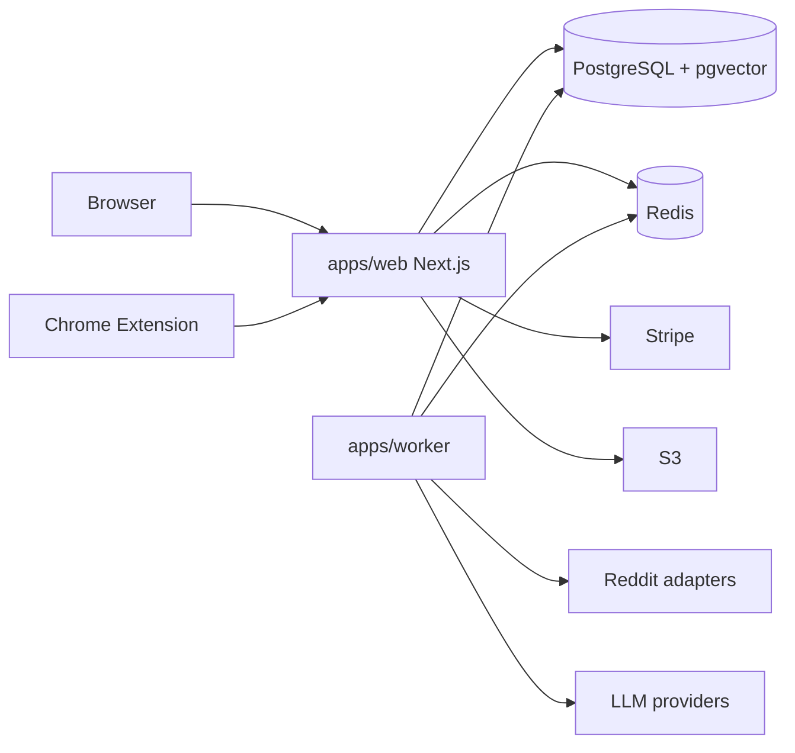

# Architecture

See `research/architecture/OVERVIEW.md` for the living architecture summary.

## Runtime diagram

```mermaid
flowchart LR
  Browser --> Web[apps/web Next.js]
  Ext[Chrome Extension] --> Web
  Web --> PG[(PostgreSQL + pgvector)]
  Web --> Redis[(Redis)]
  Worker[apps/worker] --> Redis
  Worker --> PG
  Worker --> Reddit[Reddit adapters]
  Worker --> LLM[LLM providers]
  Web --> Stripe
  Web --> S3
```
