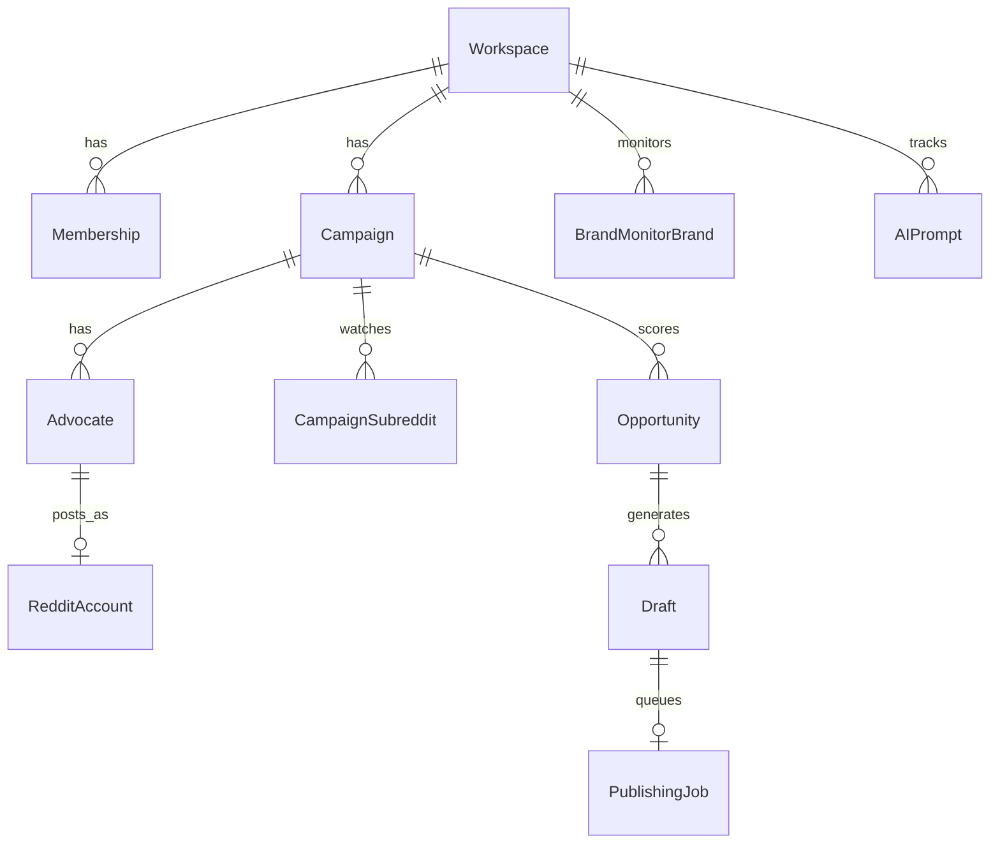

# Data Model

## Core entities

| Entity | Notes | Confidence |
|--------|-------|------------|
| User | email, passwordHash, name | HIGH |
| Workspace | mode Solo\|Team immutable, name | CONFIRMED |
| Membership | role owner\|admin\|member | CONFIRMED |
| Invitation | email, role, token, status | CONFIRMED |
| Subscription | plan, status, trialEnds, stripe ids | CONFIRMED |
| Addon | type, quantity | CONFIRMED |
| Campaign | name, productUrl, active, workspaceId | CONFIRMED |
| CampaignAssignment | userId for approvals | CONFIRMED |
| Advocate | persona fields, creativity 0–1, dailyAllocation, campaignId, redditAccountId | CONFIRMED |
| AdvocateVoiceGuideline | from refine | CONFIRMED |
| RedditAccount | username, karma, age, verifiedEmail, isMod, warmupStartedAt | CONFIRMED |
| Subreddit | name, minKarma, rules cache | CONFIRMED |
| CampaignSubreddit | active flag | CONFIRMED |
| KnowledgeDocument | type pdf/md/txt/url, chunks | CONFIRMED |
| RedditPost | external id, title, body, subreddit, score, url | HIGH |
| Opportunity | postId, campaignId, score components, status | HIGH |
| Draft | content, type warmup\|promo, status, versions | CONFIRMED |
| DraftVersion | content, model, promptVersion | HIGH |
| PublishingJob | draftId, status, attempts | CONFIRMED |
| PublishedContent | redditCommentId, metrics | CONFIRMED |
| ScanRun | duration, postsFound, draftsGenerated, status | CONFIRMED |
| BrandMonitorBrand | domain, workspace | CONFIRMED |
| Mention | url, sentiment, subreddit, detectedAt | CONFIRMED |
| VisibilityBrand | separate from BM brands | CONFIRMED |
| AIPrompt | text, workspace | CONFIRMED |
| AIQueryRun | engine, response, ranAt | HIGH |
| Citation | domain, url, position | HIGH |
| VisibilitySnapshot | metrics JSON + reproducible components | HIGH |
| ExtensionActivity | type, payload, at | CONFIRMED |
| ApiKey | hash, prefix cp_, credits | CONFIRMED |
| Notification | channel, type, read | HIGH |
| Integration | slack tokens | CONFIRMED |
| AuditLog | actor, action, entity | HIGH |
| JobRecord | queue job metadata | HIGH |

## Cardinalities (key)

- Workspace 1—* Campaign, Membership, BrandMonitorBrand, VisibilityBrand
- Campaign 1—* Advocate, CampaignSubreddit, KnowledgeDocument
- Advocate 0..1 RedditAccount (assign one)
- Opportunity 1—* Draft (typically 1)
- Draft 1—* DraftVersion; 0..1 PublishingJob

## Deletion

- Soft delete: Campaign, Advocate, Draft, ApiKey
- CASCADE: Membership on Workspace delete (restricted in practice)
- SET NULL: Draft.publishedContent optional links

## ER (simplified)

