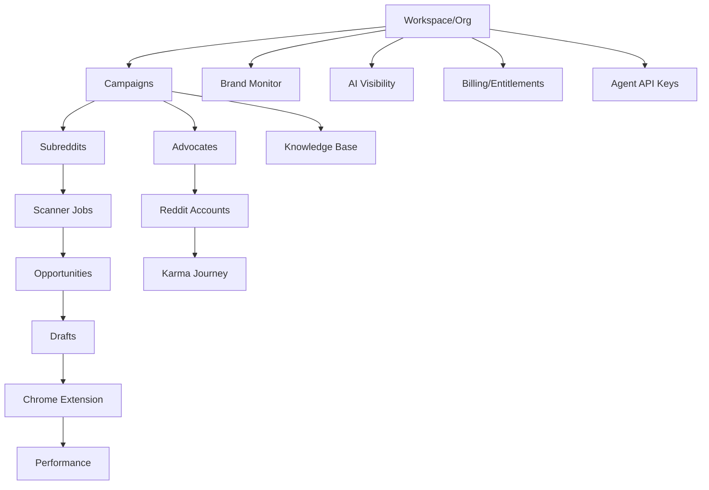

# Product Map — CitePath (parity target: ReddGrow observable contract)

**Independent brand:** CitePath  
**Reference:** ReddGrow (black-box)  
**Date:** 2026-07-28

## Product thesis (CONFIRMED — marketing + help)

Help brands get cited by AI assistants by participating in Reddit threads that LLMs already cite. Core loop: discover relevant threads → AI draft → human approve → publish via Chrome extension → track Reddit performance + AI visibility.

## Surface map

```
Marketing Site (reddgrow.ai)
├── Home / Value prop / How it works
├── Pricing
├── Help Center
├── Blog
└── Free AI Visibility Report CTA

Docs (docs.reddgrow.ai)
├── Agent API (19 endpoints)
├── CLI (@reddgrow/cli)
├── Guides
└── MCP Server

App (app.reddgrow.ai) [auth]
├── Onboarding (8 steps)
├── Dashboard
├── Performance
├── Journey (Karma)
├── Drafts
├── Campaigns
├── Advocates (+ Refine)
├── Accounts (Reddit)
├── Subreddits
├── Brand Monitor (Overview / Mentions / Subreddits / Brands)
├── AI Visibility (Overview / Prompts / Sources / Brands)
├── Settings (9 tabs)
└── Extension auth callback

Chrome Extension (MV3 presumed)
├── Session bridge from app
├── Queue posting on reddit.com
├── Performance / karma sync
└── Activity events → Settings → Activity
```

## Module dependencies



## Confidence

| Area | Confidence |
|------|------------|
| Feature inventory from Help Center | CONFIRMED |
| Exact pixel UI of dashboard | UNKNOWN (auth wall) |
| Internal scoring weights | UNKNOWN — independently designed |
| Exact Stripe price IDs | UNKNOWN |
| Community Mgmt module depth | LOW-CONFIDENCE INFERENCE (marketing only) |
