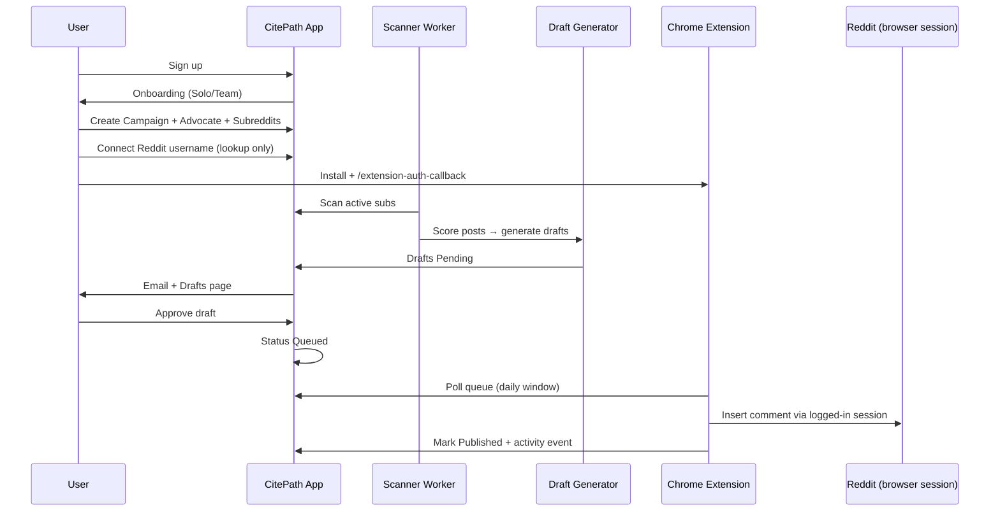
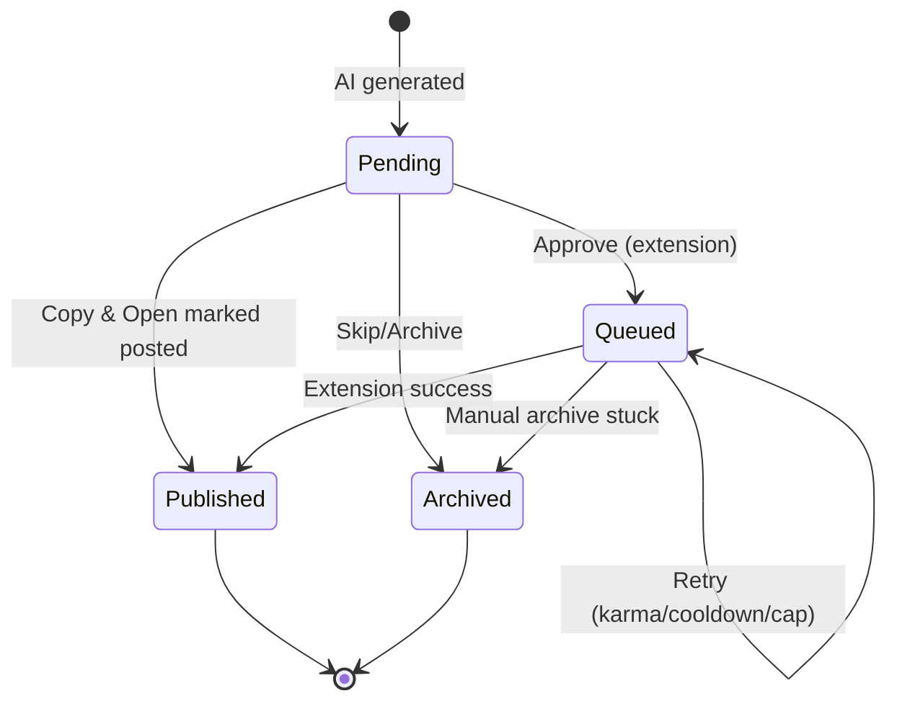

# User Flows

## F1 — Signup → First Published Comment

**Confidence:** CONFIRMED (Help Center)

## F2 — Draft state machine

**Confidence:** CONFIRMED

## F3 — Brand Monitor

Brand/domain added → mention ingestion → classify sentiment → Overview metrics + Mentions feed + Subreddit breakdown

**Confidence:** CONFIRMED (surfaces); scoring internals UNKNOWN

## F4 — AI Visibility / GEO

Brand + competitors + topics → prompts → scheduled query runs (supported interfaces) → extract mentions/citations → Visibility Score / Share of Voice / Citation Rate → historical snapshots

**Confidence:** CONFIRMED (surfaces + metrics names); query execution mechanism HIGH-CONFIDENCE INFERENCE (public claims “as real users, not APIs” — we implement via supported provider APIs where available, document difference)

## F5 — Advocate Refine

Open refine → show 5 sample drafts → user rewrites → extract tone/vocab/structure/disclosure → bake into future generations

**Confidence:** CONFIRMED

## F6 — Billing trial expiry

Trial active → countdown banner → modals at 3d/1d/expiry → scanning pauses until plan selected

**Confidence:** CONFIRMED
